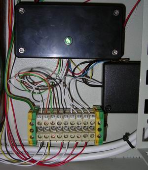

## Source code for project: [Simple lights/relays controller with 3 channels](https://link.stdout.no/T)

Control three lights or relays, with toggle switches and status LEDs. Uses an AVR ATtiny2313 microcontroller.

Written in basic, using [Bascom-AVR](http://www.mcselec.com/).

### Author
[Thomas Jensen](https://thomas.stdout.no)
